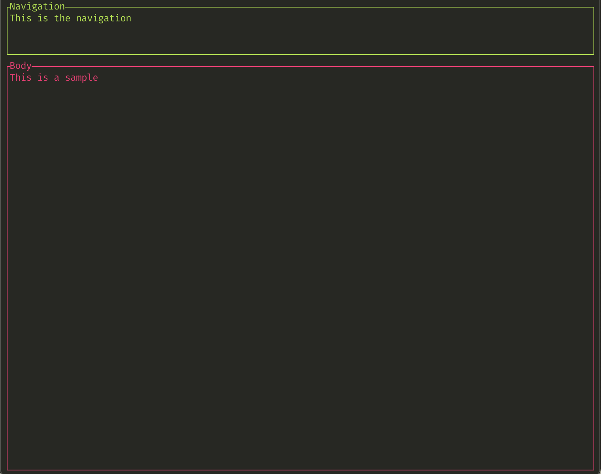

# tui-markup-renderer
Rust library to use TUI and markup to build UI terminal interfaces.

## Explanation
### How it works

As a developer is easier to create a known data structure describing the user interface.

Sample markup code:

```xml
<layout id="root" direction="vertical">
  <container id="nav_container" constraint="5">
    <p id="toolbar" title="Navigation" border="all" styles="fg:green">
      This is the navigation
    </p>
  </container>
  <container id="body_container" constraint="10min">
    <p id="body" title="Body" border="all" styles="fg:red">
      This is a sample
    </p>
  </container>
</layout>
```

generates:



### A more complex sample:

```xml
<layout id="root" direction="vertical">
  <container id="nav_container" constraint="5">
    <p id="toolbar" title="Actions" border="all" styles="fg:green">
      This is a sample
    </p>
  </container>
  <container id="body_container" constraint="10min">
    <block id="body_block" border="none">
      
      <layout id="content_info" direction="horizontal">
        <container id="ats_container" constraint="20%">
          <block id="ats_block" title="Ats" border="all">
      
          </block>
        </container>
        <container id="cnt_container" constraint="20min">
          <block id="cnt_block" title="Cnt" border="all">
            
          </block>
        </container>
      </layout>

    </block>
  </container>
  <container id="nav_container" constraint="5">
    <p id="footer" border="all" styles="bg:red;fg:black">
      This is a sample
    </p>
  </container>
</layout>
```

generates:


## How to use it

You can use it as in the next piece of code:

```rust
use crossterm::event::{KeyCode, KeyModifiers, KeyEvent};
use tui_markup_renderer::parser::MarkupParser;

fn main() -> Result<(), Box<dyn std::error::Error>> {
    let mp = MarkupParser::new(String::from("./assets/layout.tml"));

    mp.ui_loop(|key_event: KeyEvent| {
        let res = match key_event {
            KeyEvent {
              modifiers: KeyModifiers::CONTROL,
              code: KeyCode::Char('q'),
              ..
            } => true,
            _ => false,
        };
        res
    })?;

    Ok(())
}

```

## Planned features

* Add documentation to use it.
* Improce render loop to simplify the code.
* Add events to widgets.
* Runtime template change.
* Add state management to enable/disable UI features.

